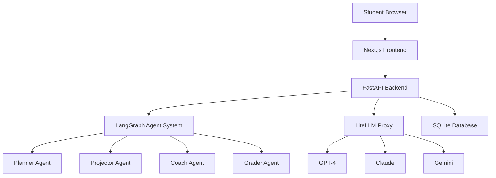

# Hebrew AI Tutor 🎓✨

An AI-powered educational platform that teaches 5th-grade Hebrew-speaking students to code through interactive game development using p5.js. Features a complete agent-based tutoring system with LangGraph orchestration and LiteLLM model routing.

## 🚀 Quick Start

### Prerequisites
- Node.js 18+ and npm
- Python 3.11+
- Git

### Installation

```bash
# Clone the repository
git clone <repository-url>
cd ai-tutor2

# Setup Python virtual environment
python -m venv venv
source venv/bin/activate  # On Windows: venv\Scripts\activate
pip install -r requirements.txt

# Install Node.js dependencies
npm install

# Copy and configure environment variables
cp .env.example .env
# Edit .env with your API keys and configuration
```

### Development

```bash
# Start the frontend development server
npm run dev

# In a separate terminal, start the backend
cd backend
python main.py
```

The application will be available at:
- Frontend: http://localhost:3001
- Backend API: http://localhost:8000
- API Documentation: http://localhost:8000/docs

## 🏗️ Architecture

### System Overview



### Core Components

#### Frontend (Next.js 15 + TypeScript)
- **Monaco Editor**: Code editing with Hebrew RTL support
- **p5.js Integration**: Creative coding canvas for game development
- **Matter.js**: Physics engine for interactive games
- **Accessibility**: WCAG 2.2 AA compliance with Hebrew TTS
- **Themes**: Football, Space, and Robots/Transformers

#### Backend (FastAPI + Python)
- **LangGraph Agents**: State machine for tutoring workflow
- **LiteLLM Integration**: Multi-model routing and management
- **SQLite Database**: Session and progress tracking
- **Monitoring**: Real-time metrics with psutil
- **Hebrew Processing**: RTL text handling and validation

#### Agent System (LangGraph)
1. **Planner**: Creates personalized lesson plans
2. **Projector**: Generates coding milestones and examples
3. **Coach**: Provides hints and guidance
4. **Grader**: Evaluates code submissions and awards XP

### Technology Stack

**Frontend:**
- Next.js 15.5.3 with TypeScript
- Tailwind CSS with RTL support
- Framer Motion for animations
- React Testing Library + Jest

**Backend:**
- FastAPI with async/await
- LangGraph for agent orchestration
- LiteLLM for model routing
- aiosqlite for async database operations
- pydantic for data validation

**AI/ML:**
- GPT-4 for lesson planning
- Claude for code feedback
- Gemini for creative content
- Custom Hebrew NLP utilities

## 📁 Project Structure

```
ai-tutor2/
├── src/                          # Frontend source code
│   ├── app/                      # Next.js app router pages
│   │   ├── learn/[theme]/[lesson]/  # Main learning interface
│   │   ├── rewards/              # Gamification system
│   │   └── globals.css           # Global styles with RTL support
│   ├── components/               # React components
│   │   ├── Speech/               # TTS and voice features
│   │   ├── Accessibility/        # WCAG compliance utilities
│   │   └── CodeEditor.tsx        # Monaco editor wrapper
│   └── types/                    # TypeScript definitions
├── backend/                      # Python backend
│   ├── agents/                   # LangGraph agent implementations
│   │   └── tutor_agent.py        # Main tutoring state machine
│   ├── services/                 # Core services
│   │   ├── litellm_client.py     # LLM integration
│   │   └── database.py           # SQLite operations
│   ├── utils/                    # Utilities
│   │   ├── hebrew_utils.py       # Hebrew text processing
│   │   └── monitoring.py         # System metrics
│   └── main.py                   # FastAPI application
├── config.yaml                  # System configuration
├── tests/                        # Test suites
└── docs/                         # Documentation
```

## 🎯 Features

### Educational Features
- **Interactive Coding**: Learn programming through game creation
- **Hebrew-First**: Complete RTL support with Hebrew UI and prompts
- **Progressive Learning**: Adaptive difficulty based on student progress
- **Multi-Modal**: Visual, audio, and kinesthetic learning styles
- **Gamification**: XP, badges, and achievement system

### Technical Features
- **AI Tutoring**: Personalized guidance from LangGraph agents
- **Multi-Model LLM**: Intelligent routing between GPT-4, Claude, Gemini
- **Real-Time Testing**: Instant code validation with Mocha/Chai
- **Accessibility**: Screen reader support, keyboard navigation
- **Performance**: Optimized for low-bandwidth connections

### Themes
1. **Football** ⚽: Create soccer games with physics
2. **Space** 🚀: Build space exploration simulations
3. **Robots** 🤖: Design transformer and robot animations

## 🧪 Testing

```bash
# Frontend tests
npm run test                    # Unit tests
npm run test:watch             # Watch mode
npm run test:coverage          # Coverage report
npm run test:accessibility     # A11y tests
npm run test:rtl               # RTL layout tests
npm run test:hebrew            # Hebrew processing tests

# Backend tests
cd backend
pytest                         # Python unit tests
pytest --cov                   # Coverage report

# End-to-end tests
npm run test:e2e               # Playwright tests
npm run test:e2e:ui            # Interactive mode
```

## 📊 Monitoring & Analytics

### Built-in Metrics
- Session completion rates
- Code submission success rates
- Learning velocity per concept
- System performance metrics
- Hebrew text processing accuracy

### Health Endpoints
- `GET /health` - System health check
- `GET /api/admin/metrics` - Detailed metrics
- `GET /api/admin/agent-status` - Agent performance

## 🔧 Configuration

The system uses a single `config.yaml` file for all configuration:

```yaml
# LLM Configuration
llm:
  router_settings:
    routing_strategy: "usage-based-routing-v2"
  model_list:
    - model_name: "gpt-4-hebrew-coach"
    - model_name: "claude-code-feedback"

# Agent Configuration
agent:
  max_retries: 3
  timeout_seconds: 30

# Hebrew Processing
hebrew:
  rtl_support: true
  font_family: "Noto Sans Hebrew"
```

## 🚀 Deployment

### Development
```bash
npm run dev         # Frontend
python backend/main.py  # Backend
```

### Production
```bash
npm run build       # Build frontend
npm run start       # Start frontend
uvicorn backend.main:app --host 0.0.0.0 --port 8000  # Backend
```

### Docker (Coming Soon)
```bash
docker-compose up
```

## 🛠️ Development Workflow

### Adding New Features
1. Create feature branch: `git checkout -b feature/new-lesson-type`
2. Update `config.yaml` if needed
3. Implement frontend components in `src/components/`
4. Add backend endpoints in `backend/`
5. Write tests for both frontend and backend
6. Update documentation
7. Submit pull request

### Agent Development
1. Define new agent in `backend/agents/`
2. Register in LangGraph workflow
3. Add prompts to `config.yaml`
4. Test with multiple LLM models
5. Monitor performance metrics

## 📈 Next Steps

### Immediate Priorities
- [ ] **Session Management**: Implement automatic session cleanup
- [ ] **Security Hardening**: Environment variable validation
- [ ] **Performance Optimization**: Add caching layer
- [ ] **Error Handling**: Comprehensive error boundaries
- [ ] **Production Deployment**: Docker containerization

### Short-term (1-2 weeks)
- [ ] **Advanced Analytics**: Student learning insights
- [ ] **Multi-Language**: Add Arabic language support
- [ ] **Collaborative Features**: Student-to-student sharing
- [ ] **Teacher Dashboard**: Progress monitoring tools
- [ ] **Mobile App**: React Native implementation

### Medium-term (1-2 months)
- [ ] **AI Improvements**: Fine-tuned Hebrew coding models
- [ ] **Advanced Games**: 3D environments with Three.js
- [ ] **Curriculum Expansion**: More programming concepts
- [ ] **Integration**: LMS and school system APIs
- [ ] **Scalability**: Microservices architecture

### Long-term (3-6 months)
- [ ] **AR/VR Support**: Immersive coding environments
- [ ] **Advanced AI**: GPT-4 fine-tuning for Hebrew education
- [ ] **Global Expansion**: Multi-country deployment
- [ ] **Research Platform**: Educational effectiveness studies

## 🤝 Contributing

1. Fork the repository
2. Create a feature branch
3. Make your changes
4. Add tests
5. Submit a pull request

### Code Style
- Frontend: ESLint + Prettier
- Backend: Black + flake8
- Commits: Conventional Commits

### Testing Requirements
- All new features must include tests
- Minimum 80% code coverage
- Accessibility tests for UI components
- Hebrew text processing validation

## 📚 Documentation

- [API Documentation](./docs/api.md)
- [Agent System Guide](./docs/agents.md)
- [Hebrew Processing](./docs/hebrew.md)
- [Deployment Guide](./docs/deployment.md)
- [Contributing Guide](./docs/contributing.md)

## 🐛 Known Issues

- Hebrew utils test failure (1/5 backend tests)
- Console.log statements in production code
- No automatic session cleanup
- Missing input validation on some endpoints

See [Issues](./docs/issues.md) for detailed tracking.

## 📄 License

MIT License - see [LICENSE](./LICENSE) for details.

## 🙏 Acknowledgments

- OpenAI for GPT-4 integration
- Anthropic for Claude API
- Google for Gemini Pro
- The Hebrew education community
- Open source contributors

---

**Built with ❤️ for Hebrew-speaking students learning to code**

For support or questions, please open an issue or contact the development team.