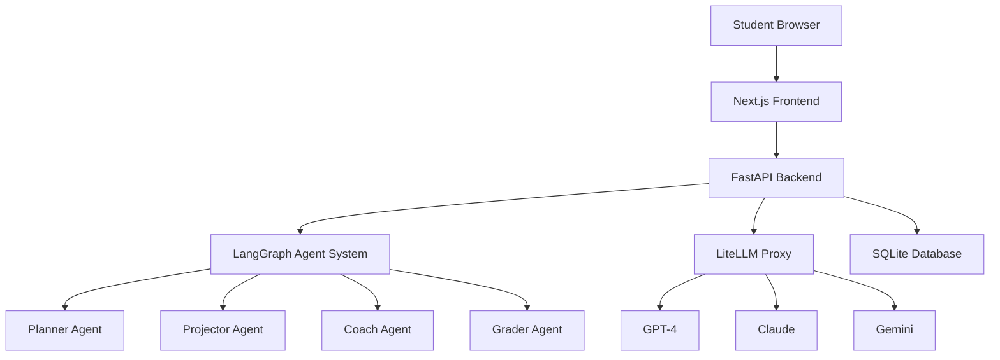

# Hebrew AI Tutor 🎓✨

An AI-powered educational platform that teaches 5th-grade Hebrew-speaking students to code through interactive game development using p5.js. Features a complete agent-based tutoring system with LangGraph orchestration and LiteLLM model routing.

## 🚀 Quick Start

### Prerequisites
- Node.js 18+ and npm
- Python 3.11+
- Git

### Installation

```bash
# Clone the repository
git clone <repository-url>
cd ai-tutor2

# Setup Python virtual environment
python -m venv venv
source venv/bin/activate  # On Windows: venv\Scripts\activate
pip install -r requirements.txt

# Install Node.js dependencies
npm install

# Copy and configure environment variables
cp .env.example .env
# Edit .env with your API keys and configuration
```

### 🎯 Easy Start with CLI Tool (Recommended)

We've built a production-quality CLI tool that manages everything for you:

```bash
# Make the CLI tool executable
chmod +x scripts/tutor.py

# Start everything in development mode
./scripts/tutor.py start --dev

# The application will be available at:
# - Frontend: http://localhost:3001
# - Backend API: http://localhost:8000
# - API Documentation: http://localhost:8000/docs

# Check what's running
./scripts/tutor.py status

# Monitor health
./scripts/tutor.py health

# Stop everything when done
./scripts/tutor.py stop
```

### Manual Development (Alternative)

If you prefer to manage services manually:

```bash
# Start the frontend development server
npm run dev

# In a separate terminal, start the backend
cd backend
python main.py
```

## 🛠️ CLI Tool Commands

The `scripts/tutor.py` CLI tool provides complete pipeline management:

### Service Management
```bash
# Start services
./scripts/tutor.py start                    # Start both frontend and backend
./scripts/tutor.py start --dev              # Development mode (recommended)
./scripts/tutor.py start --prod             # Production mode
./scripts/tutor.py start --frontend-only    # Only start Next.js frontend
./scripts/tutor.py start --backend-only     # Only start FastAPI backend

# Custom configuration
./scripts/tutor.py start --port-frontend 3002 --port-backend 8001 --workers 4

# Stop and restart
./scripts/tutor.py stop                     # Stop all services
./scripts/tutor.py restart                  # Restart all services
```

### Monitoring and Health
```bash
# Check service status
./scripts/tutor.py status                   # Human-readable status
./scripts/tutor.py status --json            # JSON output for scripts
./scripts/tutor.py status --watch           # Continuous monitoring

# Health checks
./scripts/tutor.py health                   # Overall system health
./scripts/tutor.py health --json            # JSON health data
```

### Development Tools
```bash
# Run tests
./scripts/tutor.py test                     # Run all tests
./scripts/tutor.py test --type backend      # Backend tests only
./scripts/tutor.py test --type frontend     # Frontend tests only
./scripts/tutor.py test --watch             # Watch mode for TDD

# Environment validation
./scripts/tutor.py config --validate        # Check if everything is set up correctly
./scripts/tutor.py config                   # Show current configuration
```

### Global Options
```bash
# Available for all commands
--verbose                                   # Detailed output
--log-level DEBUG|INFO|WARNING|ERROR       # Set verbosity
--config FILE                              # Use custom config file

# Example: Debug a startup issue
./scripts/tutor.py --verbose --log-level DEBUG start --dev
```

## 🌐 Accessing the Application

Once started with the CLI tool, you can access:

### Frontend (Student Interface)
- **Local URL**: http://localhost:3001
- **Network URL**: http://YOUR-IP:3001 (shown when you start the CLI tool)
- **What you'll see**: Hebrew language learning interface with three themes:
  - ⚽ **Football**: Create soccer games with physics
  - 🚀 **Space**: Build space exploration simulations
  - 🤖 **Robots**: Design transformer and robot animations

**🌐 Network Access**: The CLI tool automatically configures the frontend to accept connections from any device on your network. Perfect for classrooms where students use tablets or other devices!

### Backend API
- **URL**: http://localhost:8000
- **Health Check**: http://localhost:8000/health
- **API Documentation**: http://localhost:8000/docs (Swagger UI)
- **Admin Metrics**: http://localhost:8000/api/admin/metrics

### Development Tools
```bash
# Real-time status monitoring (shows network URLs)
./scripts/tutor.py status --watch

# Get network access URLs
./scripts/tutor.py status             # Shows local and network URLs

# Check if services are responding
curl http://localhost:3001/           # Frontend (local)
curl http://YOUR-IP:3001/             # Frontend (network)
curl http://localhost:8000/health     # Backend health
curl http://localhost:8000/docs       # API docs

# View logs with verbose output
./scripts/tutor.py --verbose --log-level DEBUG status
```

## 🏗️ Architecture

### System Overview



### Core Components

#### Frontend (Next.js 15 + TypeScript)
- **Monaco Editor**: Code editing with Hebrew RTL support
- **p5.js Integration**: Creative coding canvas for game development
- **Matter.js**: Physics engine for interactive games
- **Accessibility**: WCAG 2.2 AA compliance with Hebrew TTS
- **Themes**: Football, Space, and Robots/Transformers

#### Backend (FastAPI + Python)
- **LangGraph Agents**: State machine for tutoring workflow
- **LiteLLM Integration**: Multi-model routing and management
- **SQLite Database**: Session and progress tracking
- **Monitoring**: Real-time metrics with psutil
- **Hebrew Processing**: RTL text handling and validation

#### Agent System (LangGraph)
1. **Planner**: Creates personalized lesson plans
2. **Projector**: Generates coding milestones and examples
3. **Coach**: Provides hints and guidance
4. **Grader**: Evaluates code submissions and awards XP

### Technology Stack

**Frontend:**
- Next.js 15.5.3 with TypeScript
- Tailwind CSS with RTL support
- Framer Motion for animations
- React Testing Library + Jest

**Backend:**
- FastAPI with async/await
- LangGraph for agent orchestration
- LiteLLM for model routing
- aiosqlite for async database operations
- pydantic for data validation

**AI/ML:**
- GPT-4 for lesson planning
- Claude for code feedback
- Gemini for creative content
- Custom Hebrew NLP utilities

## 📁 Project Structure

```
ai-tutor2/
├── src/                          # Frontend source code
│   ├── app/                      # Next.js app router pages
│   │   ├── learn/[theme]/[lesson]/  # Main learning interface
│   │   ├── rewards/              # Gamification system
│   │   └── globals.css           # Global styles with RTL support
│   ├── components/               # React components
│   │   ├── Speech/               # TTS and voice features
│   │   ├── Accessibility/        # WCAG compliance utilities
│   │   └── CodeEditor.tsx        # Monaco editor wrapper
│   └── types/                    # TypeScript definitions
├── backend/                      # Python backend
│   ├── agents/                   # LangGraph agent implementations
│   │   └── tutor_agent.py        # Main tutoring state machine
│   ├── services/                 # Core services
│   │   ├── litellm_client.py     # LLM integration
│   │   └── database.py           # SQLite operations
│   ├── utils/                    # Utilities
│   │   ├── hebrew_utils.py       # Hebrew text processing
│   │   └── monitoring.py         # System metrics
│   └── main.py                   # FastAPI application
├── config.yaml                  # System configuration
├── tests/                        # Test suites
└── docs/                         # Documentation
```

## 🎯 Features

### Educational Features
- **Interactive Coding**: Learn programming through game creation
- **Hebrew-First**: Complete RTL support with Hebrew UI and prompts
- **Progressive Learning**: Adaptive difficulty based on student progress
- **Multi-Modal**: Visual, audio, and kinesthetic learning styles
- **Gamification**: XP, badges, and achievement system

### Technical Features
- **AI Tutoring**: Personalized guidance from LangGraph agents
- **Multi-Model LLM**: Intelligent routing between GPT-4, Claude, Gemini
- **Real-Time Testing**: Instant code validation with Mocha/Chai
- **Accessibility**: Screen reader support, keyboard navigation
- **Performance**: Optimized for low-bandwidth connections

### Themes
1. **Football** ⚽: Create soccer games with physics
2. **Space** 🚀: Build space exploration simulations
3. **Robots** 🤖: Design transformer and robot animations

## 🧪 Testing

```bash
# Frontend tests
npm run test                    # Unit tests
npm run test:watch             # Watch mode
npm run test:coverage          # Coverage report
npm run test:accessibility     # A11y tests
npm run test:rtl               # RTL layout tests
npm run test:hebrew            # Hebrew processing tests

# Backend tests
cd backend
pytest                         # Python unit tests
pytest --cov                   # Coverage report

# End-to-end tests
npm run test:e2e               # Playwright tests
npm run test:e2e:ui            # Interactive mode
```

## 📊 Monitoring & Analytics

### Built-in Metrics
- Session completion rates
- Code submission success rates
- Learning velocity per concept
- System performance metrics
- Hebrew text processing accuracy

### Health Endpoints
- `GET /health` - System health check
- `GET /api/admin/metrics` - Detailed metrics
- `GET /api/admin/agent-status` - Agent performance

## 🔧 Configuration

The system uses a single `config.yaml` file for all configuration:

```yaml
# LLM Configuration
llm:
  router_settings:
    routing_strategy: "usage-based-routing-v2"
  model_list:
    - model_name: "gpt-4-hebrew-coach"
    - model_name: "claude-code-feedback"

# Agent Configuration
agent:
  max_retries: 3
  timeout_seconds: 30

# Hebrew Processing
hebrew:
  rtl_support: true
  font_family: "Noto Sans Hebrew"
```

## 🚀 Deployment

### Development (Recommended: Use CLI Tool)
```bash
# Easy way - let the CLI tool handle everything
./scripts/tutor.py start --dev

# Manual way (if you prefer more control)
npm run dev         # Frontend
python backend/main.py  # Backend
```

### Production
```bash
# Using CLI tool (recommended)
./scripts/tutor.py start --prod --workers 4

# Manual production deployment
npm run build       # Build frontend
npm run start       # Start frontend
uvicorn backend.main:app --host 0.0.0.0 --port 8000 --workers 4  # Backend
```

### Docker (Coming Soon)
```bash
docker-compose up
```

## 🔧 Troubleshooting

### Common Issues with CLI Tool

#### Environment Setup
```bash
# Check if everything is configured correctly
./scripts/tutor.py config --validate

# Common issues and fixes:
# ❌ Python 3.8+ required, got 3.7
# ✅ Solution: Update Python or use correct virtual environment

# ❌ Node.js not found in PATH
# ✅ Solution: Install Node.js 18+ or check PATH

# ❌ Port 3001 is already in use
# ✅ Solution: Stop other services or use different ports
./scripts/tutor.py start --port-frontend 3002 --port-backend 8001
```

#### Service Issues
```bash
# Check what's actually running
./scripts/tutor.py status --json

# Verbose debugging
./scripts/tutor.py --verbose --log-level DEBUG start --dev

# Force stop if services are stuck
pkill -f "next"      # Stop frontend
pkill -f "uvicorn"   # Stop backend
```

#### Frontend Access Issues
```bash
# Verify frontend is running
curl http://localhost:3001/
./scripts/tutor.py health --json

# Get network access URL
./scripts/tutor.py status              # Shows your network IP

# Test network access from another device
curl http://YOUR-IP:3001/              # Replace YOUR-IP with actual IP

# Check browser console for errors
# Common fixes:
# - Clear browser cache and cookies
# - Ensure firewall allows port 3001
# - Check that devices are on same network
```

#### Network Access Issues
```bash
# Check your network IP address
./scripts/tutor.py status              # Shows network URLs

# Test if port is accessible from network
# From another device: telnet YOUR-IP 3001

# Common network issues:
# ❌ Firewall blocking port 3001
# ✅ Solution: Allow port 3001 in firewall
# ❌ Devices on different networks/VLANs
# ✅ Solution: Ensure all devices on same network
# ❌ Router blocking internal connections
# ✅ Solution: Check router AP isolation settings
```

#### Backend API Issues
```bash
# Test backend health
curl http://localhost:8000/health

# View API documentation
open http://localhost:8000/docs

# Check backend logs
./scripts/tutor.py --verbose --log-level DEBUG status
```

### Performance Tips

```bash
# Monitor resource usage
./scripts/tutor.py status --watch

# Optimize for development (fewer workers)
./scripts/tutor.py start --dev --workers 1

# Production optimization
./scripts/tutor.py start --prod --workers 4
```

### CLI Tool Features

```bash
# Get help for any command
./scripts/tutor.py start --help
./scripts/tutor.py status --help

# Run comprehensive tests
./scripts/tutor.py test

# Clean up old sessions (when implemented)
./scripts/tutor.py clean --sessions

# Create database backup (when implemented)
./scripts/tutor.py backup --file my-backup.db
```

## 🛠️ Development Workflow

### Adding New Features
1. Create feature branch: `git checkout -b feature/new-lesson-type`
2. Update `config.yaml` if needed
3. Implement frontend components in `src/components/`
4. Add backend endpoints in `backend/`
5. Write tests for both frontend and backend
6. Update documentation
7. Submit pull request

### Agent Development
1. Define new agent in `backend/agents/`
2. Register in LangGraph workflow
3. Add prompts to `config.yaml`
4. Test with multiple LLM models
5. Monitor performance metrics

## 📈 Next Steps

### Immediate Priorities
- [ ] **Session Management**: Implement automatic session cleanup
- [ ] **Security Hardening**: Environment variable validation
- [ ] **Performance Optimization**: Add caching layer
- [ ] **Error Handling**: Comprehensive error boundaries
- [ ] **Production Deployment**: Docker containerization

### Short-term (1-2 weeks)
- [ ] **Advanced Analytics**: Student learning insights
- [ ] **Multi-Language**: Add Arabic language support
- [ ] **Collaborative Features**: Student-to-student sharing
- [ ] **Teacher Dashboard**: Progress monitoring tools
- [ ] **Mobile App**: React Native implementation

### Medium-term (1-2 months)
- [ ] **AI Improvements**: Fine-tuned Hebrew coding models
- [ ] **Advanced Games**: 3D environments with Three.js
- [ ] **Curriculum Expansion**: More programming concepts
- [ ] **Integration**: LMS and school system APIs
- [ ] **Scalability**: Microservices architecture

### Long-term (3-6 months)
- [ ] **AR/VR Support**: Immersive coding environments
- [ ] **Advanced AI**: GPT-4 fine-tuning for Hebrew education
- [ ] **Global Expansion**: Multi-country deployment
- [ ] **Research Platform**: Educational effectiveness studies

## 🤝 Contributing

1. Fork the repository
2. Create a feature branch
3. Make your changes
4. Add tests
5. Submit a pull request

### Code Style
- Frontend: ESLint + Prettier
- Backend: Black + flake8
- Commits: Conventional Commits

### Testing Requirements
- All new features must include tests
- Minimum 80% code coverage
- Accessibility tests for UI components
- Hebrew text processing validation

## 📚 Documentation

- [API Documentation](./docs/api.md)
- [Agent System Guide](./docs/agents.md)
- [Hebrew Processing](./docs/hebrew.md)
- [Deployment Guide](./docs/deployment.md)
- [Contributing Guide](./docs/contributing.md)

## 🐛 Known Issues

- Hebrew utils test failure (1/5 backend tests)
- Console.log statements in production code
- No automatic session cleanup
- Missing input validation on some endpoints

See [Issues](./docs/issues.md) for detailed tracking.

## ⚡ Quick Reference

### Essential Commands
```bash
# Setup and start
git clone <repo> && cd ai-tutor2
python -m venv venv && source venv/bin/activate
pip install -r requirements.txt && npm install
chmod +x scripts/tutor.py
./scripts/tutor.py start --dev

# Access the application
open http://localhost:3001     # Frontend (Hebrew learning interface)
open http://localhost:8000/docs # Backend API documentation

# Monitor and control
./scripts/tutor.py status      # Check what's running
./scripts/tutor.py health      # Health check
./scripts/tutor.py stop        # Stop everything
```

### URLs Once Running
- **🎓 Student Interface**:
  - Local access: http://localhost:3001
  - **Network access**: http://YOUR-IP:3001 (accessible from any device on your network!)
  - Choose between Football ⚽, Space 🚀, or Robots 🤖 themes
  - Interactive Hebrew coding lessons with AI tutoring
- **🔧 API Documentation**: http://localhost:8000/docs
- **💓 Health Check**: http://localhost:8000/health
- **📊 Admin Metrics**: http://localhost:8000/api/admin/metrics

**Note**: The CLI tool automatically configures the frontend for external access - students can access the learning platform from tablets, phones, or other computers on the same network!

### CLI Tool Help
```bash
./scripts/tutor.py --help              # Full command reference
./scripts/tutor.py start --help        # Start command options
./scripts/tutor.py config --validate   # Environment check
```

For complete CLI documentation: [scripts/README.md](./scripts/README.md)

## 📄 License

MIT License - see [LICENSE](./LICENSE) for details.

## 🙏 Acknowledgments

- OpenAI for GPT-4 integration
- Anthropic for Claude API
- Google for Gemini Pro
- The Hebrew education community
- Open source contributors

---

**Built with ❤️ for Hebrew-speaking students learning to code**

For support or questions, please open an issue or contact the development team.